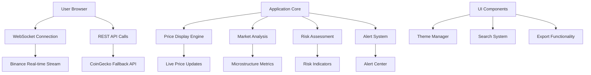

# Crypto View 📊


> Real-time cryptocurrency analytics dashboard with professional market microstructure indicators and risk assessment tools.

[](https://your-demo-link.com)
[](https://github.com/Ajith-data-analyst/Crypto_View/releases)
[](LICENSE)
[](https://developer.mozilla.org/en-US/docs/Web/JavaScript)
[](https://websockets.org)


## 🚀 Features

- ⚡ **Real-time Price Updates** - Live WebSocket streaming from Binance
- 📈 **Market Microstructure Analysis** - Order flow imbalance, volume slope, bid-ask metrics
- 🔍 **Anomaly Detection** - Automatic detection of unusual market movements
- 📊 **Volatility Metrics** - 1h, 4h, and 24h volatility gauges
- ⚠️ **Risk Indicators** - Visual risk assessment with multi-factor analysis
- 🎨 **Theme Toggle** - Light/dark mode support
- 🔎 **Universal Search** - Quick navigation across coins, metrics, and alerts
- 📱 **Responsive Design** - Optimized for desktop and mobile
- 📥 **Data Export** - PDF reports with current market data

## 🛠️ Tech Stack

| Category | Technologies |
|----------|--------------|
| **Frontend** | HTML5, CSS3, Vanilla JavaScript |
| **Real-time** | WebSocket API, Binance Stream |
| **APIs** | Binance API, CoinGecko API |
| **Charts** | Custom CSS Gauges & Metrics |
| **Export** | jsPDF for PDF generation |
| **Styling** | CSS Custom Properties, Flexbox, Grid |

## 📦 Installation

### Prerequisites
- Modern web browser with JavaScript enabled
- Internet connection for API calls

### Quick Start
```bash
# Clone the repository
git clone https://github.com/Ajith-data-analyst/Crypto_View.git

# Navigate to project directory
cd Crypto_View

# Open in browser (no build process required!)
open index.html
```

### Alternative: Direct File Opening
Simply open `index.html` in your preferred web browser. No server setup required!

## 📁 Project Structure

```
Crypto_View/
├── index.html          # Main application HTML structure
├── style.css          # Complete styling with CSS custom properties
├── app.js            # Core application logic and WebSocket handling
├── README.md         # Project documentation (this file)
└── assets/           # Static assets (if any)
    └── images/       # Screenshots and demo images
```

## 🏗️ Architecture



## 🔌 API Documentation

### Data Sources
- **Primary**: Binance WebSocket (`wss://stream.binance.com:9443/stream`)
- **Fallback**: CoinGecko REST API (`https://api.coingecko.com/api/v3`)

### Supported Cryptocurrencies
- Bitcoin (BTC), Ethereum (ETH), Cardano (ADA)
- Polkadot (DOT), Solana (SOL), Binance Coin (BNB)
- Ripple (XRP), Dogecoin (DOGE), Litecoin (LTC)

### WebSocket Events
```javascript
// Ticker update structure
{
  "stream": "btcusdt@ticker",
  "data": {
    "c": "currentPrice",
    "h": "24hHigh",
    "l": "24hLow", 
    "v": "24hVolume",
    "p": "priceChange",
    "P": "priceChangePercent"
  }
}
```

## 💡 Usage Examples

### Real-time Monitoring
```javascript
// The dashboard automatically connects and displays:
// - Live price with color-coded changes
// - Market microstructure metrics
// - Risk assessment indicators
// - Anomaly detection alerts
```

### Keyboard Shortcuts
- `Ctrl/Cmd + K` - Open universal search
- `↑/↓` - Navigate search results  
- `Enter` - Select search result
- `Escape` - Close search panel

### Theme Switching
Click the floating action button (FAB) with moon/sun icon to toggle between light and dark themes.

## 🤝 Contributing

We welcome contributions! Please feel free to submit issues, fork the repository, and create pull requests.

### Development Setup
1. Fork the repository
2. Create a feature branch (`git checkout -b feature/amazing-feature`)
3. Commit your changes (`git commit -m 'Add amazing feature'`)
4. Push to the branch (`git push origin feature/amazing-feature`)
5. Open a Pull Request

### Code Style
- Use consistent JavaScript ES6+ syntax
- Follow existing CSS custom property patterns
- Maintain responsive design principles
- Ensure WebSocket error handling is robust

## 📄 License

This project is licensed under the MIT License - see the [LICENSE](LICENSE) file for details.

## ⭐ Show Your Support

If you find this project helpful, please give it a star! It helps others discover the tool and encourages further development.

[](https://star-history.com/#Ajith-data-analyst/Crypto_View&Date)

## 🙏 Acknowledgments

- **Binance** - For providing reliable WebSocket streams
- **CoinGecko** - For comprehensive cryptocurrency data API
- **jsPDF** - For client-side PDF generation capabilities
- **FKGroteskNeue Font** - For the clean typography

## 📞 Contact

- **GitHub**: [@Ajith-data-analyst](https://github.com/Ajith-data-analyst)
- **Project Link**: [https://github.com/Ajith-data-analyst/Crypto_View](https://github.com/Ajith-data-analyst/Crypto_View)

## 📈 Version History

- **v1.0.0** (Current)
  - Initial release with core analytics features
  - Real-time WebSocket integration
  - Complete market microstructure analysis
  - Responsive design implementation

---

**Built with ❤️ for the crypto community**


